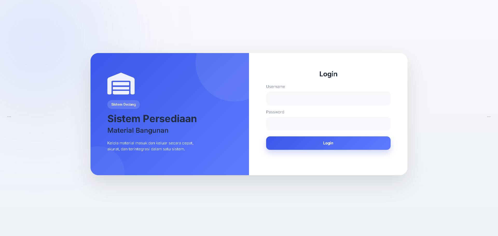

# Building Material Inventory Management System

A web-based inventory management application developed using Laravel and MySQL.

## User Role
Admin (Managing Data)
- username: admin | password: admin123

Pimpinan/Supervision (only read)
- username: agus | password: agus123

## Features

- User Authentication
- Role Management
- Material Management
- Category Management
- Incoming Material Transactions
- Outgoing Material Transactions
- Inventory Reporting
- Dashboard Monitoring

## Technologies

- Laravel
- PHP
- MySQL
- Bootstrap

## Screenshots

## Author

Satria Imam Faqih